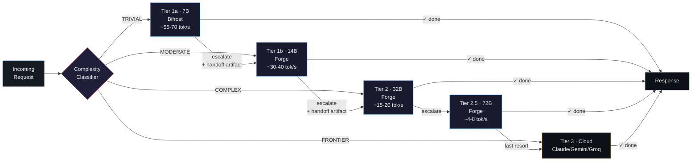
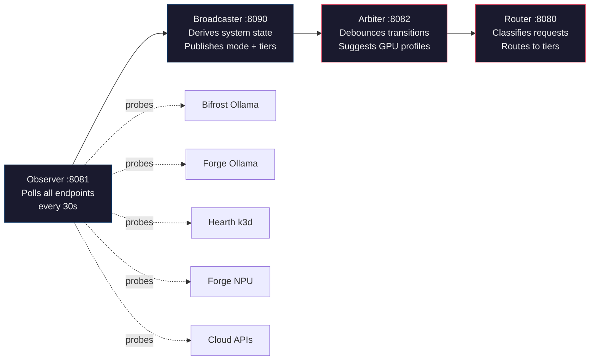
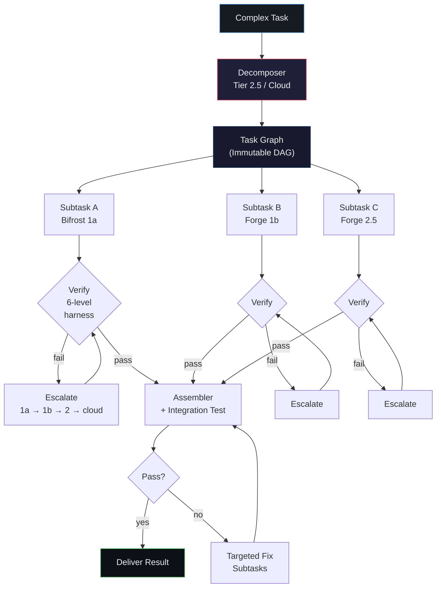
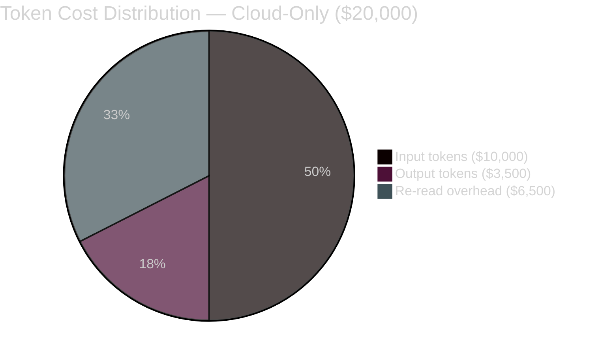

# BIFROST — Distributed AI Inference Platform

> **Intelligent routing across heterogeneous hardware. Cloud is the last resort, not the first.**

BIFROST is a distributed AI inference platform that routes coding and knowledge work across heterogeneous local hardware based on cognitive complexity, achieving **85–92% cost savings** versus cloud-only approaches. The system spans three physical machines, supports eight inference endpoints (5 local + 3 cloud) plus a dedicated micro-inference tier, and operates autonomously with hierarchical escalation — cloud APIs are a surgical supplement, not the default compute layer.

> **Industry validation:** AT&T independently arrived at the same architecture — rearchitecting around small language models and multi-agent orchestration to achieve [90% cost savings at 27 billion tokens/day](https://venturebeat.com/orchestration/8-billion-tokens-a-day-forced-at-and-t-to-rethink-ai-orchestration-and-cut). BIFROST proves the same thesis works on consumer hardware.

---

## Why

Cloud-only AI inference is expensive and unnecessary for most coding tasks. **~80% of development work is MODERATE complexity** — autocomplete, refactoring, function-level edits — and can be handled by local 7B–14B models at electricity cost. BIFROST routes every request to the cheapest tier capable of handling it, reserving cloud APIs for the genuinely hard problems.

---

## Architecture

### System Topology

```mermaid
graph TB
    subgraph BIFROST_NET["Local LAN · 2.5GbE + Tailscale Overlay"]
        direction TB

        subgraph BIF["BIFROST — Primary Workstation"]
            direction TB
            BIF_GPU["RX 9070 XT · 16GB VRAM\nVulkan Backend"]
            BIF_CPU["Ryzen 9 3950X · 64GB DDR4"]
            BIF_OLLAMA["Ollama · Tier 1a\nqwen2.5-coder:7b · ~55-70 tok/s\nqwen2.5:7b-instruct · ~50-60 tok/s\nqwen2.5-coder:14b · ~40 tok/s"]
            BIF_ROUTER["Complexity Router :8080"]
            BIF_ARBITER["Arbiter :8082"]
            BIF_IDE["VS Code + Continue.dev"]
        end

        subgraph HEARTH["HEARTH — Always-On Server (24/7 · UPS)"]
            direction TB
            H_CPU["Ryzen 7 5800G · 32GB DDR4"]
            H_IGPU["Vega 8 iGPU · ROCm\nEmbedding · Doc Classification"]
            H_K3D["k3d Cluster · inference-platform"]
            H_SERVICES["Ollama-embed · ChromaDB\nPrometheus · Grafana\nObserver :8081 · Broadcaster :8090"]
            H_STORAGE["SMB Shares · WARM/COLD Storage\nNVMe + Storage Spaces Pool"]
            H_DOCKER["Docker Compose Services\nImmich · Home Assistant · Jellyfin\nPaperless-ngx · n8n"]
        end

        subgraph FORGE["FORGE — Portable AI Workstation (On Order)"]
            direction TB
            F_GPU["Radeon 8060S · 96GB Unified VRAM\n128GB LPDDR5X"]
            F_NPU["XDNA 2 NPU · 55 TOPS\nComplexity Classification\nReal-time Embedding"]
            F_CPU["Ryzen AI Max+ 395"]
            F_OLLAMA["Ollama · Tiers 1b/2/2.5\n7B + 14B + 72B simultaneous\nor single 109B MoE"]
        end
    end

    BIF_IDE --> BIF_ROUTER
    BIF_ROUTER --> BIF_OLLAMA
    BIF_ROUTER --> F_OLLAMA
    BIF_ROUTER -->|"FRONTIER only"| CLOUD
    BIF_ARBITER -.->|consumes state| H_SERVICES
    H_IGPU --> H_SERVICES

    CLOUD["Cloud APIs\nClaude · Gemini 2.0 Flash · Groq"]

    SURFACE["Surface Pro 7\nThin Client · Tailscale RDP"] -.-> BIF
    SURFACE -.-> FORGE

    style BIF fill:#1a1a2e,stroke:#e94560,color:#eee
    style HEARTH fill:#1a1a2e,stroke:#0f3460,color:#eee
    style FORGE fill:#1a1a2e,stroke:#16213e,color:#eee,stroke-dasharray: 5 5
    style CLOUD fill:#0d1117,stroke:#58a6ff,color:#eee
    style SURFACE fill:#0d1117,stroke:#8b949e,color:#eee,stroke-dasharray: 5 5
```

### Tiered Inference Routing

Every request is classified into a cognitive complexity band and routed to the cheapest tier capable of handling it. Failed attempts escalate through the local chain before ever touching cloud.

**Key insight:** Each tier's failed attempt becomes structured input for the next tier — partial solutions and documented dead ends narrow the solution space. By the time a request reaches cloud, the query is surgically precise.

### Control Plane

The Observer → Broadcaster → Arbiter pipeline continuously monitors hardware state and automatically transitions between operating modes as machines appear and disappear on the network.

### Zero-Contention Micro-Inference

Every piece of silicon has a single dedicated purpose — no scheduling conflicts between generative inference and supporting workloads.

| Machine | Primary GPU | Micro-Inference Accelerator | Dedicated Workload |
|---------|-------------|----------------------------|--------------------|
| **Bifrost** | RX 9070 XT → LLM generation | — | — |
| **Hearth** | — | Vega 8 iGPU (ROCm) | Embedding + document classification, 24/7 |
| **Forge** | Radeon 8060S → LLM generation | XDNA 2 NPU (55 TOPS) | Complexity classification + real-time embedding |

---

## Operating Modes

The system auto-detects available hardware and configures itself. No manual switching required.

| Mode | Bifrost | Forge | Hearth | Cloud | When |
|------|:-------:|:-----:|:------:|:-----:|------|
| **JARVIS** | ✓ | ✓ LAN | ✓ | ✓ | Full power — all tiers, max parallelism |
| **WORKSHOP** | ✓ | ✗ | ✓ | ✓ | Forge offline — Bifrost compensates with heavier profiles |
| **WORKSTATION** | ✗ | ✓ LAN | ✓ | ✓ | Bifrost sleeping — Forge primary |
| **REMOTE** | ✓ | ✓ VPN | ✓ | ✓ | Surface thin client via Tailscale tunnel |
| **NOMAD** | ✗ | ✓ local | ✗ | ✓ | Forge portable, disconnected from LAN |
| **WORKSHOP-OFFLINE** | ✓ | ✗ | ✓ | ✗ | **Privacy mode** — zero cloud egress |
| **CLOUD-ONLY** | ✗ | ✗ | ✓ | ✓ | Emergency — embeddings + cloud APIs only |

Mode transitions: upgrades (hardware appears) are immediate. Downgrades (hardware disappears) drain in-flight requests for 30 seconds before reconfiguring.

---

## AUTOPILOT — Autonomous Parallel Execution

Complex tasks are decomposed into a directed acyclic graph (DAG) of subtasks, fanned out across machines for parallel execution, with each subtask independently escalating through the local tier chain.

### Verification Harness (6 Levels)

| Level | Check | Cost | Runs On |
|-------|-------|------|---------|
| 1 | Syntax / parse | Instant | CPU |
| 2 | Schema validation | Instant | CPU |
| 3 | Static analysis / lint | Fast | CPU |
| 4 | **Semantic consistency** (embedding similarity vs task spec) | Fast | **NPU / Vega 8** |
| 5 | Unit tests | Medium | CPU |
| 6 | Integration tests (cross-subtask) | Expensive | CPU |

### Safety Engineering

| Guardrail | Default | Purpose |
|-----------|---------|---------|
| Max attempts per tier | 3 | Prevents retry spirals |
| Max total escalations | 4 | Bounds the cascade depth |
| Max fix cycles | 2 | Limits integration rework |
| Max subtasks per graph | 20 | Prevents decomposition explosion |
| Per-subtask cloud spend | $0.50 | Cost containment |
| Per-task-graph cloud spend | $5.00 | Cost containment |
| Per-day cloud spend | $20.00 | Hard stop |
| SHA-256 checksums | All outputs | Catches corruption between stages |
| Wall-clock timeouts | 60s–300s by tier | Catches degenerate loops |

A model never decides its own loop budget. Every output is objectively verified. Every failure is bounded and recoverable.

---

## Cost Analysis

### The $20,000 Benchmark — Building a C Compiler

Anthropic's Nicholas Carlini built a C compiler using 16 parallel Claude Opus agents over ~2,000 sessions. The project consumed **2 billion input tokens** and **140 million output tokens**, producing 100,000 lines of Rust — at a cost of **~$20,000**.

BIFROST's key insight: **$10,000 of that cost was re-reading the codebase** across sessions. With local models, repeated context reads cost $0.

### BIFROST Execution Breakdown

| Phase | Cloud Cost | Local Cost | What Happens |
|-------|----------:|----------:|--------------|
| Architecture & decomposition | $375 | $0.50 | Claude architects the compiler structure |
| Module implementation | $0 | $15 | 72B/14B generate Rust code locally, iterate freely |
| Integration & debugging | $1,375 | $5 | Mostly local, cloud for genuinely stuck problems |
| Test suite convergence | $625 | $5 | GCC torture tests, compile real projects, fix locally |
| Final review & polish | $325 | $0.50 | Claude reviews the complete codebase |
| **Total** | **$2,700** | **$26** | |

### Side-by-Side Comparison

| | Cloud-Only | BIFROST | Savings |
|---|----------:|--------:|--------:|
| **C Compiler (Level 3)** | $20,000 | ~$2,726 | **86%** |
| **RFP Response Engine (Level 2)** | $30–80 | ~$2–5 | **90–95%** |
| **CLI Tool (Level 1)** | $5–15 | ~$0.15–0.55 | **90–97%** |

The savings come from one principle: **~80% of coding work is MODERATE complexity, not FRONTIER.** Local models handle it at electricity cost. Cloud handles the 20% that actually requires frontier reasoning.

---

## Eight-Endpoint Roster

| Tier | Model | Machine | Speed | Role | Traffic % |
|------|-------|---------|------:|------|----------:|
| **1a-coder** | qwen2.5-coder:7b | Bifrost | ~55-70 tok/s | Autocomplete, boilerplate | ~35% |
| **1a-instruct** | qwen2.5:7b-instruct | Bifrost | ~50-60 tok/s | Summarization, context distillation | ~10% |
| **1b** | qwen2.5-coder:14b | Forge | ~30-40 tok/s | Quality code gen, refactoring | ~20% |
| **2** | qwen2.5-coder:32b | Forge | ~15-20 tok/s | Multi-file refactoring | ~10% |
| **2.5** | qwen2.5:72b | Forge | ~4-8 tok/s | Architecture, deep reasoning | ~10% |
| **3-Claude** | Claude Opus/Sonnet | Cloud | — | Frontier reasoning, code review | ~8% |
| **3-Gemini** | Gemini 2.0 Flash | Cloud | — | Massive context, doc ingestion | ~4% |
| **3-Fast** | Groq / Perplexity | Cloud | — | Fast lookups, API docs | ~3% |
| **E-base** | nomic-embed-text | Hearth Vega 8 | — | Codebase embeddings (24/7) | always-on |
| **E-local** | nomic-embed-text | Forge NPU | — | Real-time AUTOPILOT embedding | when online |

---

## Current Status

**Phase 0: Base Infrastructure** — Completing

- [x] Hearth k3d cluster running
- [x] Ollama-embed, ChromaDB, Prometheus, Grafana deployed
- [x] Bifrost Ollama operational (Vulkan backend)
- [x] Models pulled: 7B coder, 7B instruct, 14B coder
- [x] SMB shares + tiered storage (HOT/WARM/COLD)
- [x] FluxCD bootstrapped
- [x] Observer v2, Broadcaster v2, Arbiter v2 code written
- [ ] GitHub repo + FluxCD sync
- [ ] VS Code + Continue.dev configured
- [ ] 32B model pull
- [ ] Anthropic API key setup

**Phase 1: Control Plane** — Next

- [ ] Deploy Observer/Broadcaster to Hearth k3d
- [ ] Deploy Arbiter to Bifrost
- [ ] Mode detection validated (WORKSHOP mode)
- [ ] `/system/status` API live
- [ ] Grafana dashboards for mode + transitions

**Phase 2:** Forge integration → JARVIS mode
**Phase 3:** AUTOPILOT pipeline + cloud APIs
**Phase 4:** Remote access + NOMAD mode
**Phase 5:** Optimization + production hardening

---

## Tech Stack

| Layer | Technology |
|-------|-----------|
| Inference Engine | Ollama (Vulkan backend, AMD AI Bundle) |
| Local Models | Qwen 2.5 Coder (7B, 14B, 32B, 72B) |
| Cloud APIs | Anthropic Claude, Google Gemini 2.0 Flash, Groq |
| Orchestration | k3d (lightweight k3s in Docker) |
| GitOps | FluxCD + GitHub + SOPS/age encryption |
| Vector Store | ChromaDB |
| Embedding | nomic-embed-text (Vega 8 iGPU / XDNA 2 NPU) |
| Monitoring | Prometheus + Grafana |
| IDE Integration | VS Code + Continue.dev |
| Network | 2.5GbE LAN + Tailscale overlay |
| Storage | Tiered HOT/WARM/COLD with SMB shares |

---

## Design Principles

1. **Local-first, privacy-first, on-site-first** — Every piece of silicon maximized for its capabilities. Cloud is the last resort.
2. **Zero contention by architecture** — Big GPUs generate tokens. Small accelerators classify and embed. CPUs orchestrate. No scheduling conflicts.
3. **Failed attempts are signal, not waste** — Each tier's dead ends narrow the solution space for the next tier.
4. **Hardware-topology-aware routing** — The system continuously adapts its capabilities based on what hardware is actually online.
5. **Objective verification, not model self-assessment** — Six-level harness with embedding similarity checks on dedicated silicon. The model's opinion of its own output is irrelevant.
6. **Hard budgets, no exceptions** — Loop limits, spend caps, timeouts, checksums. A model never decides its own loop budget.

---

## License

TBD

---

*Built by John H. Pritchard — architecture designed in collaboration with Claude (Anthropic).*
